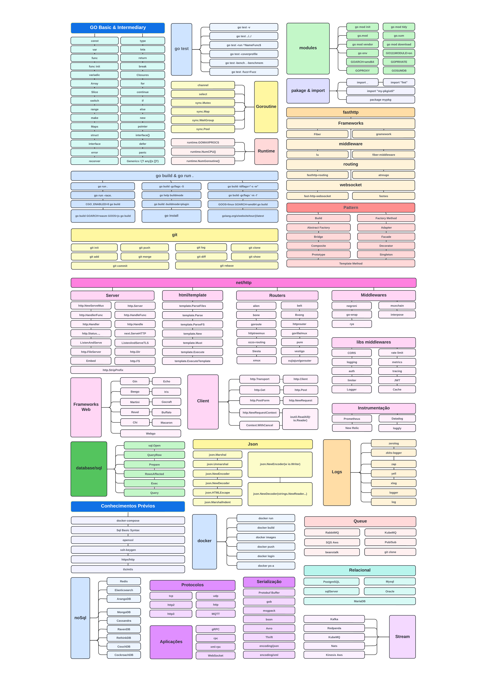

###### [Topics to be covered on our YouTube channel»](https://www.youtube.com/user/jeffotoni)

[Português](./README_ptbr.md)

> The intent of this guide is to give you an idea about the Go ecosystem and help guide your learning if you are confused. It is mainly focused on presenting the tools and concepts used in web development. Feel free to send comments
- suggestions or even a PR improving at some point. 

> I will be super happy to know that you would like to collaborate or that we helped in some way in your formation when it comes to Go.

# Go Roadmap

<object data="groadmap.pdf" type="application/pdf" width="80%" height="80%">
    <embed src="groadmap.pdf">
        
This browser does not support PDFs. Please download the PDF to view it: <a href="groadmap.pdf">Download PDF</a>.

    </embed>
</object>

# Sumary

1. Basic & Intermediate Concepts
    - generics / [T any](s []T)   
    - [constants](https://go.dev/doc/effective_go#constants)
    - [variables](https://go.dev/doc/effective_go#variables)
    - iota
    - func init
    - types
    - funcs 
    - variadic 
    - return multiples values
    - closures/anonymous functions
    - array
    - slice
    - for
    - switch 
    - if 
    - else
    - range
    - make
    - new
    - maps
    - pointers
    - structs
    - methods
    - type interface
    - interface{}
    - defer
    - error 
    - panic
    - recover

2. Goroutines
    - channel, channel buffer
    - select
    - [sync.Mutex](https://pkg.go.dev/sync#Mutex)
    - [sync.Map](https://pkg.go.dev/sync#Map)
    - [sync.WaitGroup](https://pkg.go.dev/sync#WaitGroup)
    - [sync.Pool](https://pkg.go.dev/sync#Pool)

3. Runtime
    - [runtime.GOMAXPROCS](https://pkg.go.dev/runtime#GOMAXPROCS)
    - [runtime.NumCPU()](https://pkg.go.dev/runtime#NumCPU)   
    - [runtime.NumGoroutine()](https://pkg.go.dev/runtime#NumGoroutine)
    
4. go
    - go test
        - go test -v
        - go test -run ^NameFunc$
        - go test -coverprofile
        - go test ../../
        - go test -bench . -benchmem
        - go test -fuzz=Fuzz

    - go build & go run .
        - go run .
        - go run -race .
        - CGO_ENABLED=0 go build
        - go build -ldflags="-s -w"
        - go build -gcflags '-m -l'
        - GOOS=linux GOARCH=amd64 go build
        - go build GOARCH=wasm GOOS=js go build
        - go build -gcflags -S
        - go help buildmode
        - go build -buildmode=plugin

    - go install golang.org/x/website/tour@latest

5. Modulos
    - package & import
        - import ..
        - import "fml"
        - import "my-pkg/util"
        - package mypkg

    - go.mod
    - go.sum
    - go mod init
    - go mod tidy
    - go mod vendor
    - go mod download
    - go env
    - GO111MODULE=on
    - GOARCH=amd64
    - GOPRIVATE
    - GOPROXY
    - GOSUMDB

6. Patterns
    - Build
    - Factory Method
    - Abstract Factory
    - Adapter
    - Bridge
    - Facade
    - Composite
    - Decorator
    - Prototype
    - Singleton
    - Template Method

7. fasthttp
    - Frameworks
        - [Fiber](https://github.com/gofiber/fiber)
        - [Gramework](https://github.com/gramework/gramework)

    - Middleware
        - Iu
        - fiber-middleware

    - Routing
        - [fasthttp-routing](https://github.com/qiangxue/fasthttp-routing)
        - [atreugo](https://github.com/savsgio/atreugo)

    - Websocket
        - fast-http-socket
        - [fastws](https://github.com/dgrr/fastws)

8. net/http
    - Server
        - [http.NewServeMux](https://pkg.go.dev/net/http#NewServeMux)
        - [http.Server](https://pkg.go.dev/net/http#Server)
        - [http.HandlerFunc](https://pkg.go.dev/net/http#HandlerFunc)
        - [http.HandleFunc](https://pkg.go.dev/net/http#HandleFunc)
        - [http.Handle](https://pkg.go.dev/net/http#Handle)
        - [http.Handler](https://pkg.go.dev/net/http#Handler)
        - [http.Status](https://pkg.go.dev/net/http#Status)
        - [next.ServeHTTP](https://pkg.go.dev/net/http#ServeHTTP)
        - [ListenAndServe](https://pkg.go.dev/net/http#ListenAndServe)
        - [ListenAndServeTLS](https://pkg.go.dev/net/http#ListenAndServeTLS)
        - [http.FileServer](https://pkg.go.dev/net/http#FileServer)
        - [http.Dir](https://pkg.go.dev/net/http#Dir)
        - [http.StripPrefix](https://pkg.go.dev/net/http#StripPrefix)
        - Embed
        - [http.FS](https://pkg.go.dev/net/http#FS)
        - html/template
            - [template.ParseFiles](https://pkg.go.dev/html/template#ParseFiles)
            - [template.Parse](https://pkg.go.dev/html/template#Parse)
            - [template.ParseFS](https://pkg.go.dev/html/template#ParseFS)
            - [template.New](https://pkg.go.dev/html/template#New)
            - [template.Must](https://pkg.go.dev/html/template#Must)
            - [template.Execute](https://pkg.go.dev/html/template#Execute)
            - [template.ExecuteTemplate](https://pkg.go.dev/html/template#ExecuteTemplate)

    - Client
        - [http.Transport](https://pkg.go.dev/net/http#Transport)
        - [http.Client](https://pkg.go.dev/net/http#Client)
        - [http.Get](https://pkg.go.dev/net/http#Get)
        - [http.Post](https://pkg.go.dev/net/http#Post)
        - [http.PostForm](https://pkg.go.dev/net/http#PostForm)
        - [ioutil.ReadAll(r io.Reader)](https://pkg.go.dev/io/ioutil#ReadAll)
        - [http.NewRequest](https://pkg.go.dev/net/http#NewRequest)
        - [http.NewRequestContext](https://pkg.go.dev/net/http#NewRequestContext)
        - [Context.WithCancel](https://pkg.go.dev/context#WithCancel)

    - Web Frameworks
        - [gin](https://github.com/gin-gonic/gin)
        - [echo](https://github.com/labstack/echo)
        - [beego](https://github.com/beego/beego)
        - [iris](https://github.com/kataras/iris)
        - [martini](https://github.com/go-martini/martini)
        - gocraft
        - [revel](https://github.com/revel/revel)
        - [buffalo](https://github.com/gobuffalo/buffalo)
        - [chi](https://github.com/go-chi/chi)
        - [macaron](https://github.com/go-macaron/macaron)
        - [webgo](https://github.com/bnkamalesh/webgo)

    - Routers
        - [alien](https://github.com/gernest/alien)
        - [bellt](https://github.com/GuilhermeCaruso/bellt)
        - [bone](https://github.com/go-zoo/bone)
        - [bxog](https://github.com/claygod/Bxog)
        - [goroute](https://github.com/cloudfoundry/gorouter)
        - [httprouter](https://github.com/julienschmidt/httprouter)
        - [httptreemux](https://github.com/dimfeld/httptreemux)
        - [gorilla/mux](https://github.com/gorilla/mux)
        - [ozzo-routing](https://github.com/go-ozzo/ozzo-routing)
        - pure
        - [siesta](https://github.com/VividCortex/siesta)
        - [vestigo](https://github.com/husobee/vestigo)
        - [xmux](https://github.com/rs/xmux)
        - [xujiajun/gorouter](https://github.com/xujiajun/gorouter)

    - Middlewares
        - [negroni](https://github.com/urfave/negroni)
        - [muxchain](https://github.com/stephens2424/muxchain)
        - [go-wrap](https://github.com/hexdigest/gowrap)
        - [interpose](https://github.com/carbocation/interpose)
        - [rye](https://github.com/InVisionApp/rye)
        - Middeware libs
            - CORS
            - rate limit
            - logging
            - metrics
            - auth
            - tracing
            - limiter
            - jwt
            - logger
            - cache
            - Instrumentation
                - [Prometheus](https://github.com/prometheus/prometheus)
                - [Datadog](https://github.com/DataDog/datadog-agent)
                - [New Relic](https://github.com/newrelic/go-agent)
                - [loggly](https://github.com/segmentio/go-loggly)

9. Previous Knowledge
    - [git](https://git-scm.com/)
        - git init
        - git add .
        - git commit 
        - git push
        - git merge
        - git rebase
        - git log
        - git diff
        - git show
        - git clone

    - [docker](https://www.docker.com/)
        - docker run
        - docker build
        - docker images
        - docker push
        - docker login
        - docker ps -a

    - [docker-compose](https://docs.docker.com/compose/)
    - [sql basic syntax](https://www.w3schools.com/sql/sql_syntax.asp)
    - [openssl](https://www.openssl.org/)
    - ssh-keygen
    - https/http
    - [tls/mtls](https://www.cloudflare.com/learning/access-management/what-is-mutual-tls/)

    - Relational
        - [PostgreSQL](https://www.postgresql.org/)
        - [MySql](https://www.mysql.com/)
        - [SqlServer](https://www.microsoft.com/sql-server/sql-server-2019)
        - [Oracle](https://www.oracle.com/br/database/)
        - [MariaDB](https://mariadb.org/)

    - NoSql
        - [MongoDB](https://www.mongodb.com)
        - [Cassandra](https://cassandra.apache.org/_/index.html)
        - [RavenDB](https://ravendb.net/)
        - [RethinkDB](https://rethinkdb.com/)
        - [CouchDB](https://couchdb.apache.org/)
        - [CockroachDB](https://www.cockroachlabs.com/)
        - [Redis](https://redis.io/)
        - [Elasticsearch](https://www.elastic.co/what-is/elasticsearch)
        - [ArangoDB](https://www.arangodb.com/)

    - Queue
        - [RabbitMQ](https://www.rabbitmq.com/)
        - [KubeMQ](https://kubemq.io/)
        - [SQS Aws](https://aws.amazon.com/sqs/)
        - [Pub/Sub Google Cloud](https://cloud.google.com/pubsub)
        - [Beanstalk](https://aws.amazon.com/elasticbeanstalk/)
        - [ActiveMQ](https://activemq.apache.org/)

    - Stream
        - [Kafka](https://kafka.apache.org/)
        - [Redpanda](https://redpanda.com/)
        - [KubeMQ](https://kubemq.io/)
        - [Nats](https://nats.io/)
        - [Kinesis Aws](https://aws.amazon.com/kinesis/)

    - Protocols
        - Applications
            - [gRPC](https://grpc.io/)
            - [rpc](https://en.wikipedia.org/wiki/Remote_procedure_call)
            - [xml-rpc](https://en.wikipedia.org/wiki/XML-RPC)
            - [WebSocket](https://developer.mozilla.org/docs/Web/API/WebSockets_API)
        - Serialization
            - [Protobuf Buffer](https://developers.google.com/protocol-buffers)
            - [gob](https://go.dev/blog/gob)
            - [msgpack](https://msgpack.org/)
            - [bson](https://www.mongodb.com/docs/manual/reference/bson-types/)
            - [Avro](https://avro.apache.org/)
            - [Thrift](https://thrift.apache.org/)
            - [json](https://www.json.org/json-en.html)
            - [xml](https://pt.wikipedia.org/wiki/XML)
        - [tcp](https://en.wikipedia.org/wiki/Transmission_Control_Protocol)
        - [udp](https://en.wikipedia.org/wiki/User_Datagram_Protocol)
        - [http](https://developer.mozilla.org/docs/Web/HTTP/Overview)
        - [http2](https://developers.google.com/web/fundamentals/performance/http2)
        - [http3](https://en.wikipedia.org/wiki/HTTP/3)
        - [MQTT](https://mqtt.org/)
